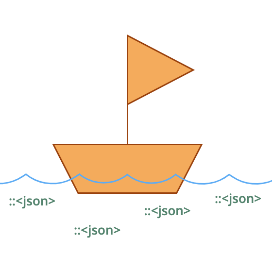

<h1 align="center">TURBO-JSON</h1>

<p align="center">

</p>

Streams JSON files and combine them into in an outputted JSON. Reading and writing are done exclusively with **streaming**.
The memory usage will [not exceed 8kb](https://doc.rust-lang.org/stable/std/io/struct.BufReader.html#method.new) instead of your files size in a no-streaming read/write process.

## Features
- Combine JSON's: `1` & `true` => `[1, true]`.
- Concatenate JSON arrays at one level deep: `[1,2,3]` & `"hello` & `[4,[5,6]]` => `[1, 2, 3, "hello", 4, [5, 6]]`.
- Files JSON's format are validated before combined.
- Validation of JSON files are multithreaded.

## Installation

```bash
git clone git@github.com:bidoubiwa/turbo-json.git
cd turbo-json
```

Make `turbo-json` a global command.
```bash
cargo install --path .
```

## Usage

The following will fetch all files inside misc recursively and output it's combined JSON.

With a **local run**:
```bash
cargo run --release -- [files]
```

**example:**
```bash
cargo run --release -- misc/**/*
```

With the **global** install:

```bash
turbo-json [files]
```

**example:**
```bash
turbo-json misc/**/*
```
